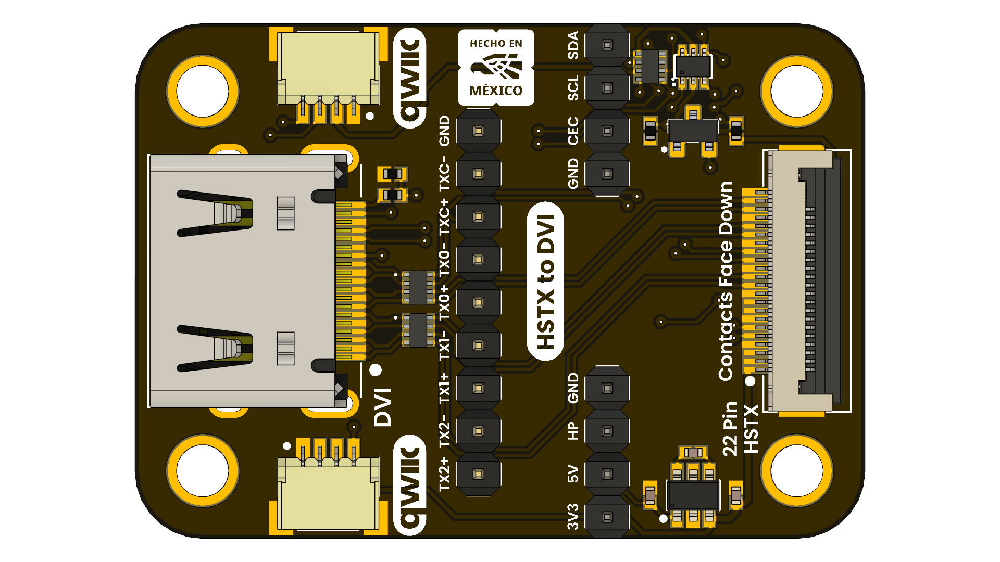

# DevLab: DVI to FPC Adapter

## Introduction

This is a precision interface board designed to transition standard DVI signals to 2.54mm pitch pin headers for prototyping, analysis, and custom embedded applications.

Distinctly features a dedicated FPC 22 pin 0.5mm compatible with HSTX protocol and QWIIC (JST 1mm) connector, bridging the DVI I2C signals to the QWIIC ecosystem. This allows microcontrollers to easily access EDID data, perform DDC/CI commands, or utilize DVI cabling as a robust, shielded transport medium for long-distance I2C communication.

The module is a passive pass-through device, preserving signal integrity for high-speed differential pairs (TMDS) while providing convenient access points for low-speed control signals (CEC, SCL, SDA, HPD).

  
  
<em>DVI to FPC Adapter</em>

### Quick Setup

## Overview

| Feature            | Description                                                                                                                   |
|--------------------|-------------------------------------------------------------------------------------------------------------------------------|
| Exposed pins       | Exposes all 19 DVI connector pins through labeled through-hole points.                                                       |
| HSTX Compatibility | Compatible with the HSTX DVI protocol via a 22-pin FPC connector.                                                                    |
| QWIIC Standard      | Routes the DDC bus (SCL/SDA) and 3.3V rails to a 4-pin Qwiic connector, enabling plug-and-play I2C connectivity. |
| Interfaces         | I2C, DVI, HSTX                                                                                                                |

## Applications

- **Custom DVI-CEC Home Automation:** Allows a microcontroller to act as a smart remote, sending commands to power TVs or switch inputs via the single-wire CEC bus.
- **Video and Image Output:** Suitable for displaying video or images on a monitor.
- **HUD and Menu Interfaces:** Create custom HUDs (Heads-Up Displays) and menus for your applications.
- **Cable Testing:** Verify cable continuity and connection stability.

## Resources

- [Schematic Diagram](#)
- [Pinout Diagram](#)
- [Getting Started Guide](#)

## 📝 License

All hardware and documentation in this project are licensed under the **MIT License**.  
See [`LICENSE.md`](LICENSE.md) for details.

  Template created by UNIT Electronics

