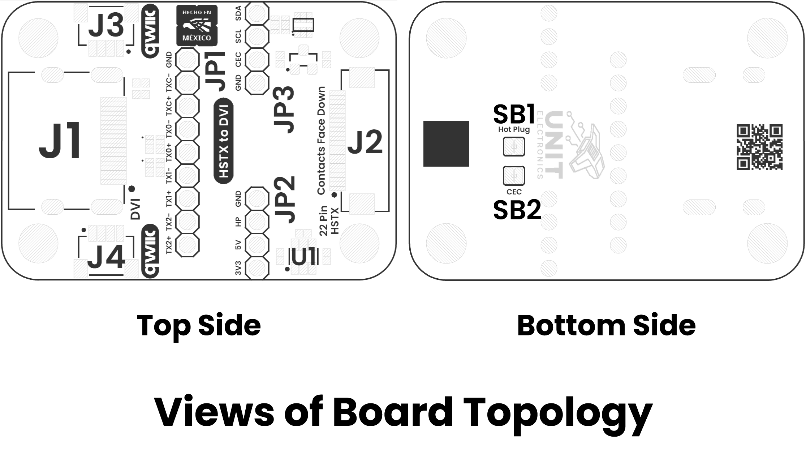
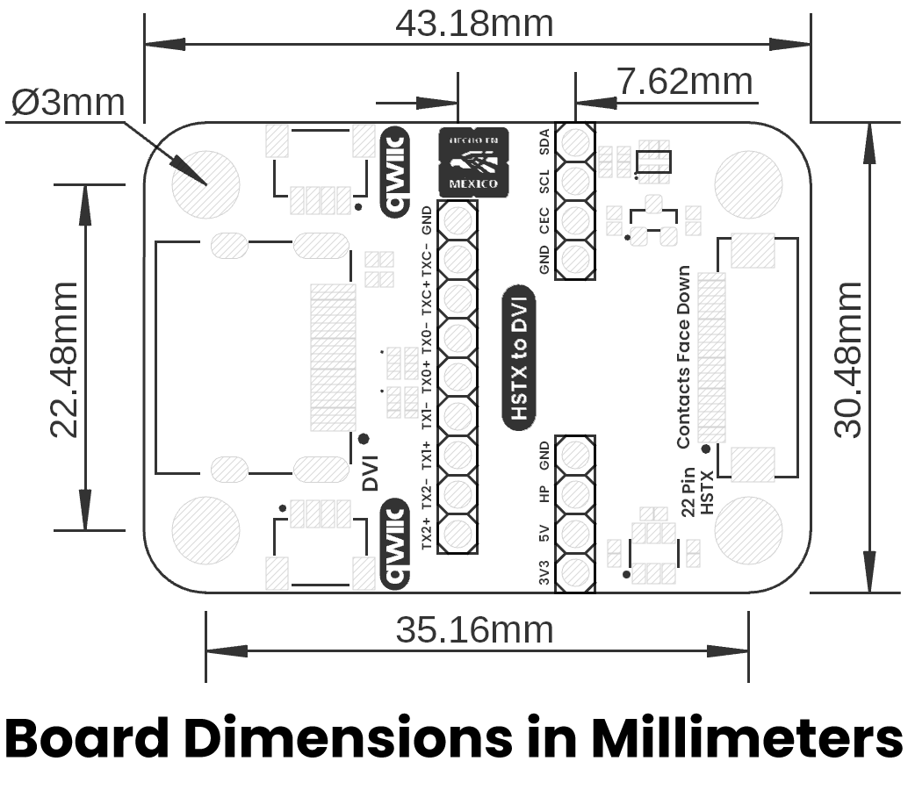

# Hardware

<a href="./resources/unit_sch_v_1_0_0_ue0117_devlab_dvi_to_fpc_adapter.pdf"> Schematic</a>

## Pinout

    <a href="#"> Pinout</a>
     
     
     

## Pin & Connector Layout

| Pin   | Voltage Level | Function                                                  |
|-------|---------------|-----------------------------------------------------------|
| VCC   | 3.3 V – 5.5 V | Provides power to the on-board regulator and sensor core. |
| GND   | 0 V           | Common reference for power and signals.                   |
| SDA   | 1.8 V to VCC  | Serial data line for I²C communications.                  |
| SCL   | 1.8 V to VCC  | Serial clock line for I²C communications.                 |

> **Note:** The module also includes a Qwiic/STEMMA QT connector carrying the same four signals (VCC, GND, SDA, SCL) for effortless daisy-chaining.

## Topology

<a href="./resources/unit_topology_v_1_0_0_ue0117_devlab_dvi_to_fpc_adapter.png">  Topology</a>
 
 
 

| Ref. |                   Description                   |
|:----:|:-----------------------------------------------:|
|  J1  |                  DVI Connector                  |
|  J2  |           FPC 22-pin 0.5mm Connector            |
|  J3  |       I2C QWIIC Connector (JST 4-Pin 1mm)       |
|  J4  |       I2C QWIIC Connector (JST 4-Pin 1mm)       |
|  U1  |              AP3602A 5V Regulator               |
| JP1  |       2.54 mm Pin Header for TMDS Signals       |
| JP2  | 2.54 mm Pin Header for Power Supply and Hotplug |
| JP3  |   2.54 mm Pin Header for I2C and CEC Signals    |
| SB1  |             Jumper pad for Hotplug              |
| SB2  |               Jumper pad for CEC                |

## Dimensions

<a href="./resources/unit_dimension_v_1_0_0_ue0117_devlab_dvi_to_fpc_adapter.png">  Dimensions</a>

